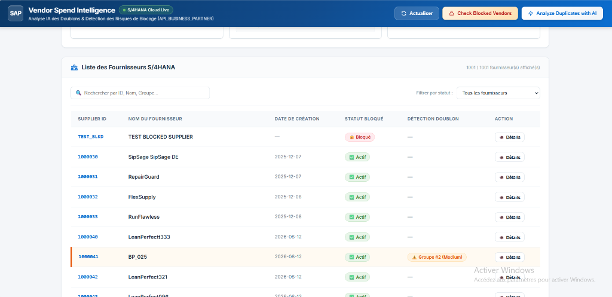
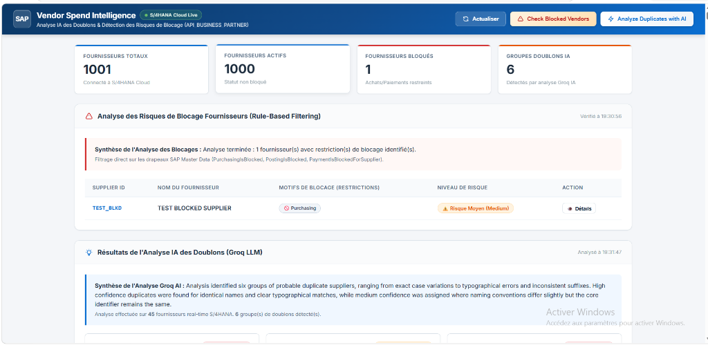
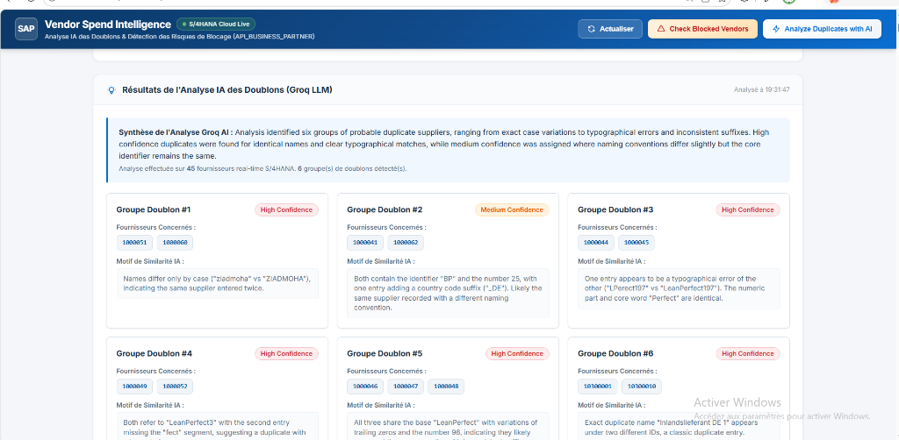

# Vendor Spend Intelligence

> **A real-world SAP BTP side-by-side extension connecting SAP S/4HANA Cloud data with AI-powered supplier risk analysis.**


---

## Overview

Large enterprise procurement teams often struggle with data quality issues in SAP S/4HANA Cloud, such as duplicate vendor records created by inconsistent naming conventions and missed purchasing restrictions. 

**Vendor Spend Intelligence** is an enterprise **side-by-side SAP BTP extension** built with the **SAP Cloud Application Programming Model (CAP)**. It connects directly to live **SAP S/4HANA Cloud** Master Data (`API_BUSINESS_PARTNER`), combining rule-based compliance checks with Groq LLM AI analysis to automatically identify blocked vendors and duplicate supplier clusters.

---

## Architecture

```text
┌──────────────────────────────┐
│      SAP S/4HANA Cloud       │  System of Record for Business Partners & Suppliers
└──────────────┬───────────────┘
               │ OData V2 (`API_BUSINESS_PARTNER`)
               ▼
┌──────────────────────────────┐
│    SAP BTP / CAP Node.js     │  Extension backend handling OData V4 services & logic
└──────────────┬───────────────┘
               │
        ┌──────┴────────┐
        ▼               ▼
┌──────────────┐ ┌────────────────┐
│ Rule Engine  │ │   Groq / LLM   │  Rule Engine detects block flags; Groq LLM clusters duplicates
└──────┬───────┘ └───────┬────────┘
       └──────────┬──────┘
                  ▼
┌──────────────────────────────┐
│     Analytics Dashboard      │  SAP Horizon UX presenting decision-ready risk insights
└──────────────────────────────┘
```

---

## Key Features

| Feature | Description |
| :--- | :--- |
| **Real S/4HANA Cloud Integration** | Live OData V2 consumption of `A_Supplier` entities via Communication Arrangement. |
| **Supplier Search & Filtering** | Instant client-side search by ID, Name, Account Group, or Risk Status. |
| **Blocked Vendor Risk Detection** | Rule-based engine identifying purchasing/posting blocks (e.g. `TEST_BLKD`). |
| **Duplicate Detection with Groq AI** | LLM-driven clustering identifying fuzzy vendor duplicates with confidence scores. |
| **Interactive Supplier Detail Drawer** | Modal displaying complete SAP master data fields, VAT numbers, and AI insights. |
| **Analytics Dashboard** | SAP Horizon Enterprise UI featuring real-time KPI metrics and visual risk indicators. |

---

## Screenshots

### 1. S/4HANA Master Data Supplier List


### 2. Blocked Vendor Risk Analysis (Rule-Based Engine)


### 3. Groq AI Duplicate Detection (LLM Governance Engine)


---

## Tech Stack

- **ERP Core**: SAP S/4HANA Cloud (`API_BUSINESS_PARTNER`)
- **Cloud Platform**: SAP BTP (Side-by-Side Extensibility)
- **IDE / Environment**: SAP Business Application Studio (BAS)
- **Framework**: SAP CAP Node.js (`@sap/cds`, `@sap-cloud-sdk`)
- **Protocols**: OData V2 (Consumption) / OData V4 (Exposition)
- **AI Engine**: Groq LLM API (Multi-model parsing & confidence scoring)
- **Frontend**: HTML5, Vanilla CSS3 (SAP Horizon Theme), JavaScript ES6+

---

## Real SAP Integration

This project is connected to a **live SAP S/4HANA Cloud Practice System**:
- Consumes standard SAP OData V2 service `API_BUSINESS_PARTNER` via a SAP Communication Arrangement.
- Retrieves real live Business Partner & Supplier datasets (e.g. `1000030`, `ziadmoha`, `LeanPerfect096`).
- Identifies real test blocked suppliers like `TEST_BLKD` (`PurchasingIsBlocked: true`) directly from S/4HANA Master Data.

---

## Security

- **Credential Isolation**: SAP credentials and Groq API keys are passed strictly via environment variables (`S4H_USERNAME`, `S4H_PASSWORD`, `GROQ_API_KEY`).
- **Git Hygiene**: Local private configuration files (`.env`, `.cdsrc-private.json`) are strictly excluded in `.gitignore`. No passwords or secret keys exist in the repository.

---

## Quick Start

```bash
# 1. Clone repo and install dependencies
git clone https://github.com/Zouguari/vendor-spend-intelligence.git
cd vendor-spend-intelligence
npm install

# 2. Setup environment variables in .env
# S4H_USERNAME=your_username
# S4H_PASSWORD=your_password
# GROQ_API_KEY=your_groq_key

# 3. Launch application locally
npx cds watch
```
Access the dashboard at `http://localhost:4004/dashboard/index.html`.

---

## What This Project Demonstrates

- **SAP S/4HANA Cloud Integration**: Consumption of standard SAP OData V2 APIs using SAP Cloud SDK.
- **SAP BTP & BAS Environment**: End-to-end cloud development workflow using SAP Business Application Studio.
- **SAP BTP Side-by-Side Extensibility**: Building cloud extensions keeping ERP core clean.
- **CAP Node.js & OData**: Mastering CAP service layers, projections, and custom handlers.
- **AI-Powered Business Analysis**: Practical LLM integration for automated enterprise data governance.
